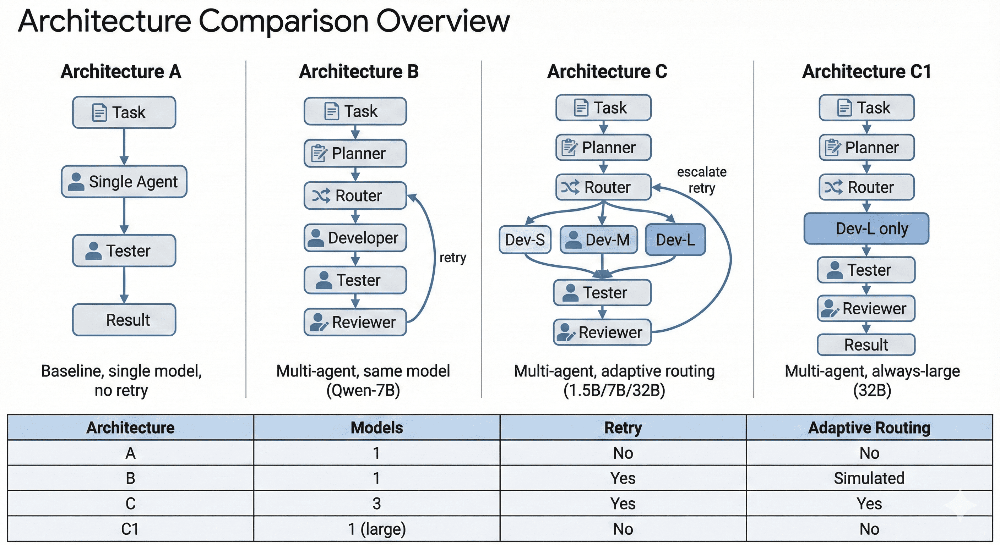
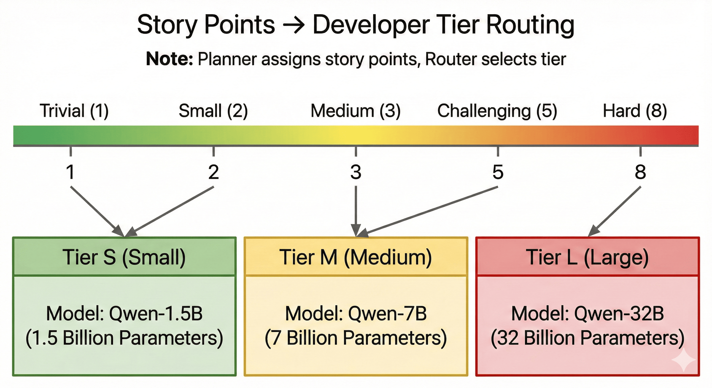
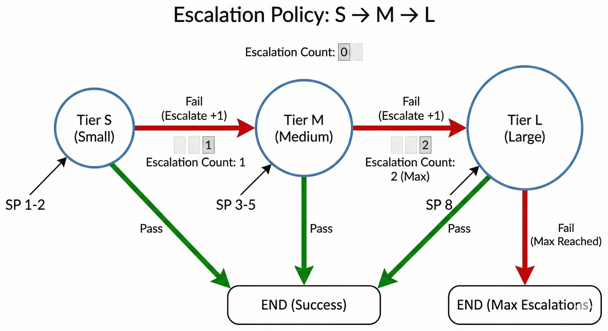
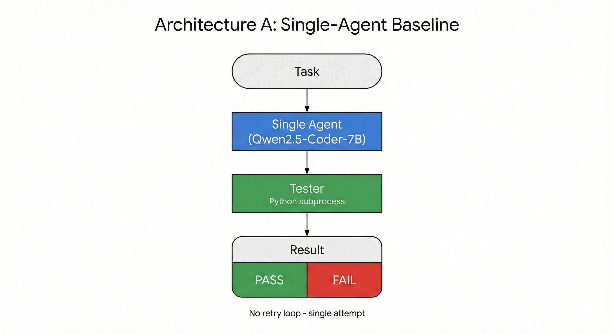
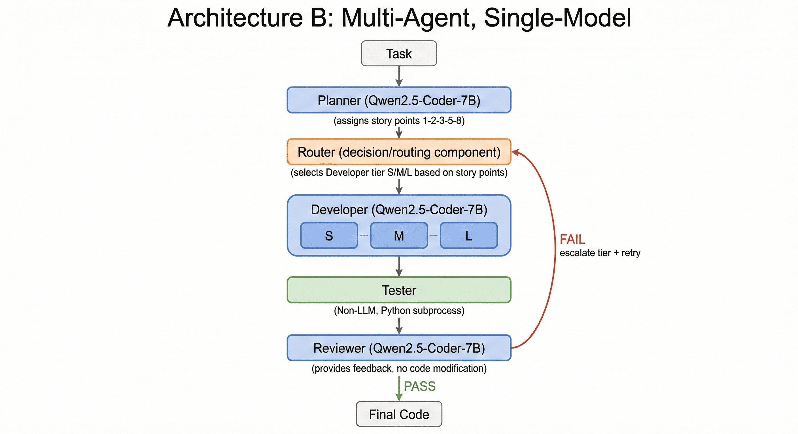
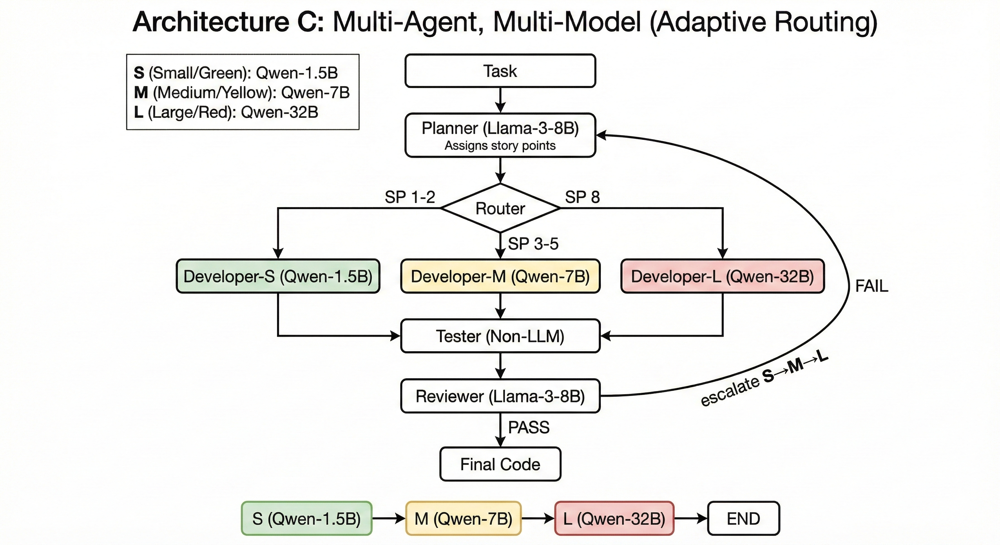
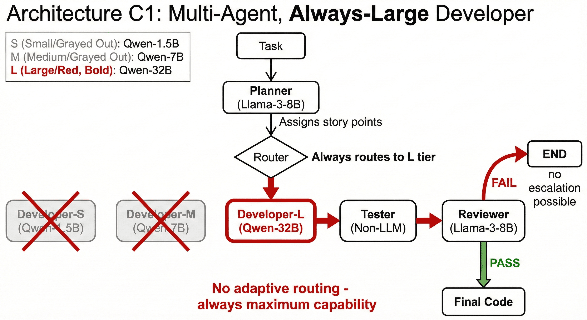
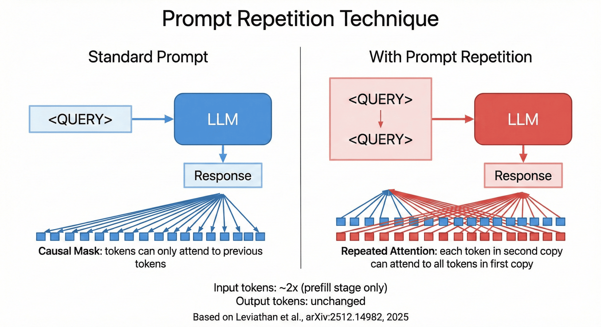

# Multi-Agent Architectures for LLM-Based Code Generation
### Evaluating Adaptive Routing and Model Specialization

[](./report/main.pdf)

[](https://www.python.org/)
[](https://huggingface.co/)
[](https://python.langchain.com/)
[](https://python.langchain.com/docs/langgraph)
[](https://smith.langchain.com/)
[](https://www.kaggle.com/)

## 📖 Overview

This project presents a systematic empirical comparison of **Multi-Agent Systems (MAS)** for automated code generation. It moves beyond simple single-prompt interactions to evaluate complex agentic pipelines that mimic real-world software engineering processes: **Planning**, **Routing**, **Development**, **Testing**, and **Code Review**.

We specifically investigate **Adaptive Routing**—a novel mechanism that dynamically assigns tasks to different model sizes (Small/Medium/Large) based on estimated difficulty (Story Points)—to determine if it can reduce computational costs without sacrificing code quality. The study benchmarks performance using the **HumanEval** dataset across various architectural configurations.

### Key Features
- **Multi-Agent Orchestration**: Implements a full Plan $\to$ Code $\to$ Test $\to$ Review loop.
- **Adaptive Routing**: Uses Scrum-style Story Points (Fibonacci sequence) to route tasks to 1.5B, 7B, or 32B parameter models.
- **Self-Correction**: A feedback loop where a Reviewer agent provides actionable insights on test failures.
- **Robust Evaluation**: Automated assertion-based testing using `pytest` in sandboxed environments.

---

## 🚀 Usage

This project is optimized to run in the cloud using **Kaggle Notebooks** for reproducible execution.

### Steps to Run

1.  **Clone the Repository**
    Clone this repository to your local machine or download the zip.

2.  **Import to Kaggle**
    *   Create a new Notebook on [Kaggle](https://www.kaggle.com/).
    *   Upload the project files (specifically the `notebook/` folder contents) into the Kaggle environment.

3.  **Configure Environment**
    *   **Enable GPU**: In the Notebook settings, verify that a GPU (e.g., T4 x2) is enabled.
    *   **Set Secrets**: Add your API keys in the Kaggle "Secrets" menu:
        *   `HF_TOKEN`: Your HuggingFace API key (required).
        *   `LANGSMITH_API_KEY`: Your LangSmith key (optional, for tracing).

4.  **Run the Notebook**
    Select one of the notebooks below and execute the cells.

---

## 📓 Notebooks

The project includes pre-configured notebooks for each architectural experiment:

| Notebook | Description |
|----------|-------------|
| `architecture-a.ipynb` | **Baseline**: Single-agent code generation (Qwen-7B). |
| `architecture-b.ipynb` | **Multi-Agent**: Full pipeline (Plan/Code/Test/Review) using a single model (Qwen-7B). |
| `architecture-c.ipynb` | **Adaptive**: Multi-agent with specialized models (1.5B/7B/32B) routed by difficulty. |
| `architecture-c1.ipynb` | **Always-Large**: Benchmark using the largest model (32B) for all tasks. |
| `ablation-no-s-model.ipynb` | **Ablation Study**: Removes the smallest tier to test reliability impact. |
| `*-pr.ipynb` | **Prompt Repetition**: Variants of A, B, and C using the Prompt Repetition technique. |

---

## 📂 Project Structure

```
project/
├── data/                  # HumanEval dataset and logs
├── docs/                  # Detailed method documentation
├── notebook/              # Jupyter notebooks for interactive analysis
├── report/                # LaTeX source of the scientific paper
│   └── figures/           # Architecture diagrams and charts
├── src/                   # Source code
│   ├── agents/            # LLM client wrappers
│   ├── graph/             # LangGraph state machine definitions
│   └── models/            # Prompts and response schemas
├── tests/                 # Unit tests for the pipeline
├── main.py                # Entry point
└── requirements.txt       # Dependencies
```

---

## 🛠️ Technology Stack

| Category | Technologies |
|----------|-------------|
| **Core** | Python 3.10+, LangGraph, LangChain |
| **LLM Inference** | HuggingFace Inference API (Serverless) |
| **Models** | Qwen2.5-Coder (1.5B, 7B, 32B), Llama-3-8B |
| **Analysis** | Radon (Cyclomatic Complexity), Pandas, Matplotlib |
| **Observability** | LangSmith (Tracing & Debugging) |

---

## 🏗️ System Architecture

The system is built on a directed cyclic graph architecture using **LangGraph**. It decomposes code generation into specialized roles, moving from a monolithic "black box" approach to an interactive pipeline.


*Figure 1: Comparison of the four evaluated architectures.*

### Core Components
1.  **Planner**: Assigns **Story Points** (1, 2, 3, 5, 8) as a proxy for difficulty.
2.  **Router**: Directs the task to the appropriate **Developer Tier** (S/M/L).
3.  **Developer**: Generates the implementation code.
4.  **Tester**: Executes the code against assertion-based tests.
5.  **Reviewer**: Analyzes failure logs and provides feedback.

---

## 🧩 Architectural Variants & Implementation

### 1. Adaptive Routing & Story Points
The core innovation is mapping Agile estimation to model selection. Easy tasks (1-2 pts) go to cheap models; hard tasks (8 pts) go to SOTA models.


*Figure 2: Mapping Logic: Story Points $\to$ Developer Tiers.*

### 2. Escalation Policy
If a selected model fails, the system **escalates** to the next stronger tier, preserving context.


*Figure 3: Automatic escalation flow upon test failure.*

### 3. Deep Dives
#### Architecture A (Baseline)


#### Architecture B (Multi-Agent)


#### Architecture C (Adaptive)


#### Architecture C1 (Always-Large)


### 4. Prompt Repetition


---

## 👥 Authors

*   **Ivan Necerini** 
*   **Jacopo Rialti**
*   **Emanuele Romano**
*   **Marco Donatucci**
*   **Ferdinando Del Vecchio**

---
